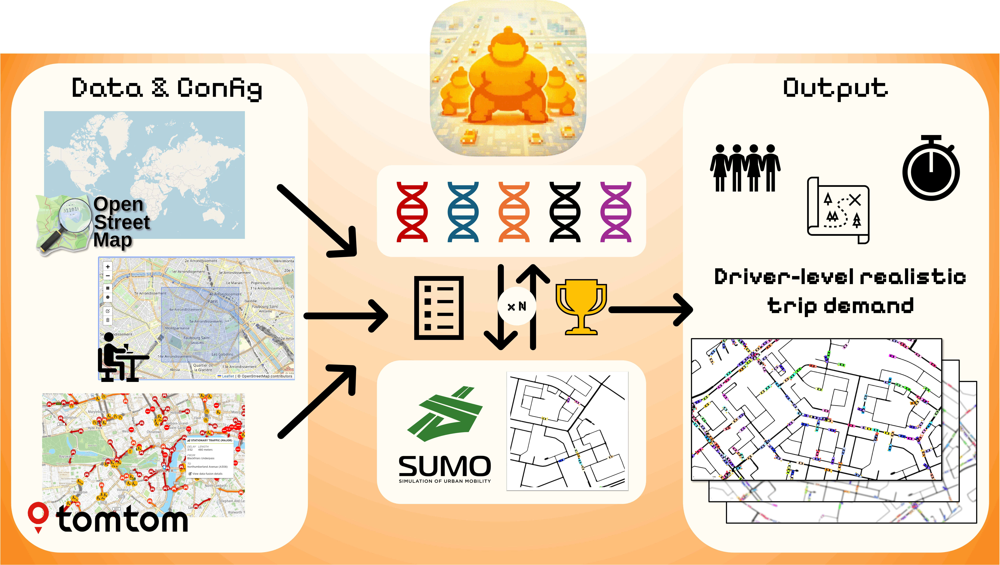
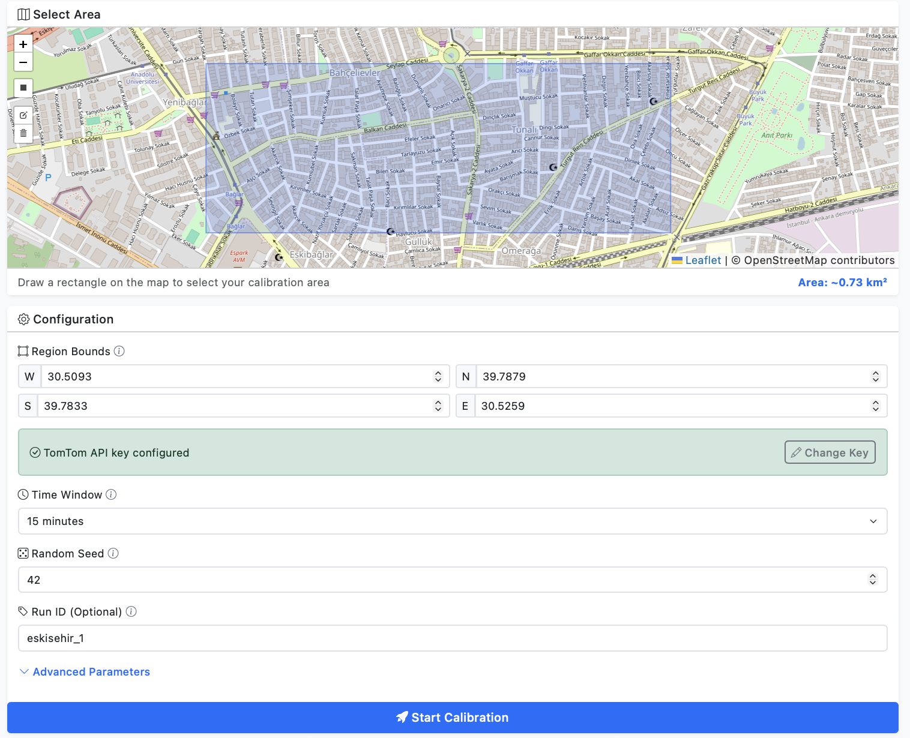

[](https://pypi.org/project/demandify/)

# Welcome to demandify!

**Turn real-world traffic data into accurate, agent-based SUMO simulations.**

Do you want to simulate real-world city traffic but don't have access to precious driver trip data? **demandify** solves that.

It's simple: Pick a spot on the map and demandify will:
1.  Fetch real-time congestion data from TomTom 🗺️
2.  Build a clean SUMO network 🛣️
3.  Use the Genetic Algorithm to figure out the demand pattern to match that traffic 🧬

The result? A ready-to-run SUMO scenario in agent-level precision that allows you to test your urban routing policies, even for your CAVs! ([wink](https://github.com/COeXISTENCE-PROJECT/URB) [wink](https://github.com/COeXISTENCE-PROJECT/RouteRL)).



## Features

- 🌍 **Real-world calibration**: Uses TomTom Traffic Flow API for live congestion data
- 🎯 **Seeded & reproducible**: Same seed = identical results for same congestion and bbox
- 🚗 **Car-only SUMO networks**: Automatic OSM → SUMO conversion with car filtering, clean networks
- 🧬 **Genetic algorithm**: Optimizes demand to match observed speeds, with advanced dynamics (feasible-elite parent selection, immigrants, assortative mating, adaptive mutation boost)
- 💾 **Smart caching**: Content-addressed caching for fast re-runs (traffic snapshots bucketed to 5-minute windows)
- 📊 **Beautiful reports**: HTML reports with visualizations and statistics
- ⌨️ **CLI native**: Live in the terminal? No problem.
- 🖥️ **Clean web UI**: Leaflet map, real-time progress stepper, log console



## Quickstart

### 1. Install demandify

```bash
# Install from PyPI (Recommended)
pip install demandify
```

If you want to contribute or install from source:
```bash
git clone https://github.com/aonurakman/demandify.git
cd demandify
pip install -e .
```

### 2. Install SUMO 🚦

**demandify** requires SUMO (Simulation of Urban MObility) to power its simulations.

👉 **[Download SUMO from the official website](https://eclipse.dev/sumo/)**

Once installed, verify it's working:
```bash
demandify doctor
```

### 3. Get a TomTom API Key

1. Sign up at [https://developer.tomtom.com/](https://developer.tomtom.com/)
2. Create a new app and copy the API key
3. The free tier includes 2,500 requests/day

### 4. Run demandify

```bash
demandify
```

This starts the web server at [http://127.0.0.1:8000](http://127.0.0.1:8000)

### 5. Calibrate a scenario

1. **Draw a bounding box** on the map
2. **Configure parameters** (defaults work well):
   - Time window: 15, 30, or 60 minutes
   - Seed: any integer for reproducibility
   - Warmup: a few minutes to populate the network
   - GA population/generations: controls quality vs speed
3. **Paste your API key** (one-time, stored locally)
4. **Click "Start Calibration"**
5. **Watch the progress** through 8 stages
6. **Download your scenario** with `demand.csv`, SUMO network, and report
   
### 6. Run Headless (Optional) 🤖

You can run the full calibration pipeline directly from the command line, ideal for automation or remote servers.

```bash
# Basic usage (defaults: window=15, pop=50, gen=20)
demandify run "2.2961,48.8469,2.3071,48.8532" --name Paris_Test_01

# Advanced usage with custom parameters
demandify run "2.2961,48.8469,2.3071,48.8532" \
  --name Paris_Optimization \
  --window 30 \
  --seed 123 \
  --pop 100 \
  --gen 50 \
  --mutation 0.5 \
  --elitism 2

# With advanced GA dynamics
demandify run "2.2961,48.8469,2.3071,48.8532" \
  --name Paris_Advanced \
  --pop 100 \
  --gen 100 \
  --immigrant-rate 0.05 \
  --magnitude-penalty 0.002 \
  --stagnation-patience 15

# Fully non-interactive (automation/CI)
demandify run "2.2961,48.8469,2.3071,48.8532" \
  --name Paris_Batch \
  --non-interactive
```

> **Note:** By default, the CLI pauses after fetching/matching data and asks for confirmation, then asks whether to run another calibration. Pass `--non-interactive` to auto-approve and exit immediately after pipeline completion.

#### Parameters

| Argument | Type | Default | Description |
|----------|------|---------|-------------|
| `bbox` | String | (Req) | Bounding box (`west,south,east,north`) |
| `--name` | String | Auto | Custom Run ID/Name |
| `--non-interactive` | Flag | off | Disable prompts (auto-approve and exit when pipeline completes) |
| `--window` | Int | 15 | Simulation duration (min) |
| `--warmup` | Int | 5 | Warmup duration before scoring (min) |
| `--seed` | Int | 42 | Random seed |
| `--step-length`| Float | 1.0 | SUMO step length (seconds) |
| `--workers` | Int | Auto (CPU count) | Parallel GA workers |
| `--tile-zoom` | Int | 12 | TomTom vector flow tile zoom |
| `--pop` | Int | 50 | GA Population size |
| `--gen` | Int | 20 | GA Generations |
| `--mutation`| Float | 0.5 | Mutation rate (per individual) |
| `--crossover`| Float| 0.7 | Crossover rate |
| `--elitism` | Int | 2 | Top individuals to keep |
| `--sigma` | Int | 20 | Mutation magnitude (step size) |
| `--indpb` | Float | 0.3 | Mutation probability (per gene) |
| `--origins` | Int | 10 | Number of origin candidates |
| `--destinations` | Int | 10 | Number of destination candidates |
| `--max-ods` | Int | 50 | Max OD pairs to generate |
| `--bin-size` | Float | 5 | Time bin size in minutes |
| `--initial-population` | Int | 1000 | Target initial number of vehicles (controls sparse initialization) |

#### Advanced GA Dynamics

These parameters control diversity mechanisms and adaptive behavior in the genetic algorithm, addressing local optima stagnation and trip count explosion.

| Argument | Type | Default | Description |
|----------|------|---------|-------------|
| `--immigrant-rate` | Float | 0.03 | Fraction of random individuals injected per generation (0–1) |
| `--elite-top-pct` | Float | 0.1 | Defines feasible elite size per generation: `n=max(1, elite_top_pct * population)` |
| `--magnitude-penalty` | Float | 0.001 | Weight for magnitude in feasible-elite parent ranking (`weight*magnitude + E-rank term`) |
| `--stagnation-patience` | Int | 20 | Generations without improvement before mutation boost activates |
| `--stagnation-boost` | Float | 1.5 | Multiplier for mutation sigma and rate during stagnation |
| `--assortative-mating` | Flag | off | Explicitly enable assortative mating |
| `--no-assortative-mating` | Flag | off | Disable assortative mating (dissimilar parent pairing, on by default) |
| `--deterministic-crowding` | Flag | off | Explicitly enable deterministic crowding |
| `--no-deterministic-crowding` | Flag | off | Disable deterministic crowding (diversity-preserving replacement, on by default) |

All advanced dynamics are **enabled by default** with conservative values. For most use cases, the defaults work well. You can disable features via the corresponding `--no-*` flags, explicitly force-enable them with `--assortative-mating` / `--deterministic-crowding`, or set `--magnitude-penalty 0` to remove magnitude pressure inside feasible-elite ranking.

## How It Works

demandify follows an 8-stage pipeline:

1. **Validate inputs** - Check bbox, parameters, API key
2. **Fetch traffic snapshot** - Get real-time speeds from TomTom (Vector Flow Tiles, cached by 5-min time bucket)
3. **Fetch OSM extract** - Download road network data
4. **Build SUMO network** - Convert OSM to car-only SUMO `.net.xml`
5. **Map matching** - Match traffic segments to SUMO edges
6. **Initialize demand** - Select routable OD pairs (lane-permission aware) and time bins
7. **Calibrate demand** - Run GA to optimize vehicle counts
8. **Export scenario** - Generate `demand.csv`, `trips.xml`, config, and report

### Advanced GA Dynamics

The genetic algorithm includes several mechanisms to avoid common pitfalls like local optima stagnation and trip count explosion:

- **Feasible-elite parent selection (with fallback)**: Individuals are first ordered by flow-fit error `E`, then filtered by feasibility (`fail_total = routing_failures + teleports`). If enough feasible candidates exist (`>= n` from `elite_top_pct`), parent tournaments are run only on that feasible elite slice using `magnitude_penalty_weight * magnitude + E-rank term`. If not, selection temporarily falls back to full-population tournaments on `E + reliability_penalty`. This fallback auto-stops once enough feasible individuals are present.
- **Random immigrants**: A small fraction of completely random individuals is injected each generation to maintain genetic diversity and escape local optima.
- **Assortative mating**: Parents are paired by dissimilarity (by genome magnitude) for crossover, promoting exploration of the search space.
- **Deterministic crowding**: Offspring compete with similar parents for population slots, preserving niche diversity.
- **Adaptive mutation boost**: If the best fitness stagnates for K generations, mutation sigma and rate are temporarily increased by a configurable multiplier. They reset automatically when improvement resumes.

The final return policy is **feasible-first**: if any feasible individual appears during the run, demandify returns the best feasible one by `E`; otherwise it returns the best raw objective and logs a warning.

The calibration report includes plots for **genotypic diversity** (mean pairwise L2 distance) and **phenotypic diversity** (σ of fitness values) across generations, along with markers indicating when mutation boost was active.

### Variability & Consistency
      
While demandify uses seeding (random seed) for all internal stochastic operations (OD selection, GA evolution), **perfect reproducibility is not guaranteed** due to the inherently chaotic nature of traffic microsimulation (SUMO) and real-time data inputs.
      
Seeding ensures *consistency* (runs look similar), but small timing differences in OS scheduling or dynamic routing decisions can lead to divergent outcomes. Traffic snapshots are cached in 5-minute buckets; using the same seed, bbox, and time bucket will reproduce demand.csv and SUMO randomness.
      
### Caching
      
demandify caches:
- OSM extracts (by bbox)
- SUMO networks (by bbox + conversion params)
- Traffic snapshots (by bbox + provider + style + tile zoom + 5-minute timestamp bucket)
- Map matching results (by bbox + network key + provider + timestamp bucket)
      
Cache location: `~/.demandify/cache/`

Clear cache: `demandify cache clear`

## CLI Commands

```bash
# Start web server (default)
demandify

# Run headless calibration
demandify run "west,south,east,north"

# Check system requirements
demandify doctor

# Set TomTom API key (CLI)
demandify set-key YOUR_KEY_HERE

# Clear cache
demandify cache clear

# Show version
demandify --version
```

## Output Files

Each run creates a folder with:

- **`demand.csv`** - Travel demand with exact schema:
  - `ID`, `origin link id`, `destination link id`, `departure timestep`
- **`trips.xml`** - SUMO trips file
- **`network.net.xml`** - SUMO network
- **`scenario.sumocfg`** - SUMO configuration (ready to run; ignores route errors by default)
- **`observed_edges.csv`** - Observed traffic speeds
- **`run_meta.json`** - Complete run metadata
- **`report.html`** - Calibration report with visualizations

Run the scenario:
```bash
cd demandify_runs/run_<timestamp>
sumo-gui -c scenario.sumocfg
```

## Configuration

### API Keys

Three ways to provide your TomTom API key:

1. **Web UI**: Paste in the form (saved to `~/.demandify/config.json`)
2. **Environment variable**: `export TOMTOM_API_KEY=your_key`
3. **`.env` file**: Copy `.env.example` to `.env` and add your key
4. **CLI**: `demandify set-key YOUR_KEY` stores it in `~/.demandify/config.json`

## Development

```bash
# Install with dev dependencies
pip install -e ".[dev]"

# Run tests
pytest

# Format code
black demandify/

# Lint
ruff check demandify/
```

## License

MIT

## Acknowledgments

- **SUMO**: [Eclipse SUMO](https://eclipse.dev/sumo/)
- **TomTom**: [Traffic Flow API](https://developer.tomtom.com/traffic-api)
- **OpenStreetMap**: [© OpenStreetMap contributors](https://www.openstreetmap.org/copyright)
